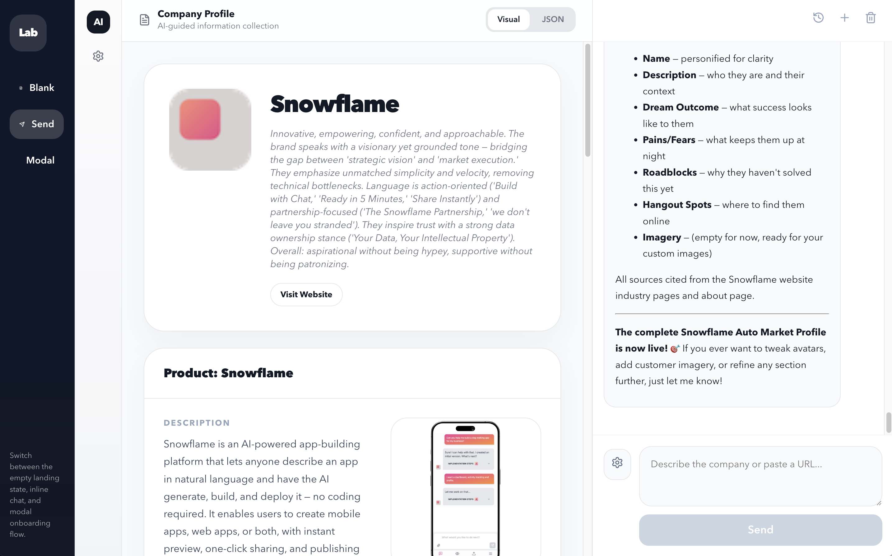

# AI Onboarding Demo

<p align="center">
  
</p>

A standalone browser demo for testing an AI-assisted onboarding flow with OpenRouter.



## Run it locally

From the repo root:

```bash
npm install
npm run dev
```

Vite will print a local URL, usually `http://localhost:5173`.

## Get an OpenRouter API key

1. Create an account or sign in at `https://openrouter.ai/`
2. Open `https://openrouter.ai/settings/keys`
3. Create a new API key
4. Start the app, open **Settings**, and paste the key into **OpenRouter API Key**

## How to use it

1. Run the app with `npm run dev`
2. Open the local Vite URL in your browser
3. Open **Settings**
4. Paste your OpenRouter API key
5. Pick a model, or add a custom OpenRouter model ID
6. Enter a company URL or a short onboarding prompt and send it

## Important note

This demo sends the OpenRouter API key directly from the browser and stores it in `localStorage`. That is fine for a local demo, but not for production. For production use, move the model calls behind your own backend.
